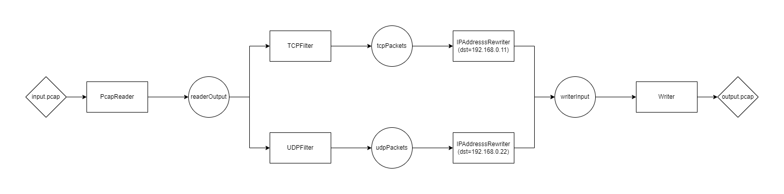
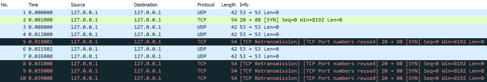
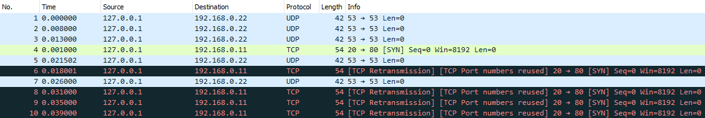

# Java Modular Packet Processor

A lightweight Java library for processing network packets with a user-defined graph of individual processing operations.

## Documentation

- [Overview](#overview)
- [User Guide](#user-guide)
- [Benchmarks](#benchmarks)
- [Future Work](#future-work)

## Overview

The Java Modular Packet Processor (JMPP) library is part of a Final Year Project (Programming Strategies for Low-Latency Applications) for the Computing BEng at Imperial College London.

The JMPP library allows users to create variations of `Processors`, consisting of `Components` that perform different operations on packets. These components are interchangeable, allowing users to specify a network of components to route packets through with a graph-like structure.

The project is not built for production, but instead has a broader objective that aligns with the purpose of the university project. Packets are passed between components using the [LMAX Disruptor](https://lmax-exchange.github.io/disruptor/), a sophisticated data structure designed to replace queues used in typical producer-consumer design patterns. JMPP contains reproducible benchmarks (collected using the Java Microbenchmark Harness) that demonstrate the advantages of the Disruptor over the high-performing `java.util.concurrent.ArrayBlockingQueue`.

The JMPP library is also built on the lightweight [pkts.io Java library developed by aboutsip](https://github.com/aboutsip/pkts).

## User Guide

Processors consist of `Readers`, `Components`, and `Outputters`. `Disruptors` are used to pass `Packets` between the different objects, which serve as alternatives to classic `Queue` implementations.

The following sections describe these core concepts, their roles within JMPP, and how to tie them together into a new Processor.

### Readers

`Readers` are responsible for providing packets to the processor. At the moment, packets can only be obtained from Pcap files; processors cannot take in streams of packets from sockets (which is a major feature that needs to be implemented).

| Class      | Description                                                                                    |
|------------|------------------------------------------------------------------------------------------------|
| PcapReader | Creates a stream of packets from a Pcap file, publishing them to an output Disruptor (buffer). |

### Components

`Components` are the heart of JMPP and are responsible for analysing the Packets that are passed through them. These are classified into 3 distinct subcategories:

- `Filters` identify packets with specific traits, such as common headers within the TCP/IP model, or specific address ranges.
- `Rewriters` modify attributes of packets at different layers, including addresses, ports, etc.
- `Outputters` process packets to be accessed beyond the processor (except for `Droppers`). In the graph of Components for each processor, these can be considered "leaf nodes", i.e. the last stage of processing.

Every component records the number of packets that it processes, which is accessible via the `getPacketCount()` method. Future work involves making metric collection an option, reducing the performance impact that may be associated with this. 

The tables below outline the components available and their functionalities.

#### Filters

| Class                 | Description                                                      |
|-----------------------|------------------------------------------------------------------|
| IPv4Filter            | Outputs packets with an IPv4 (Layer 3) header                    |
| IPv6Filter            | Outputs packets with an IPv6 (Layer 3) header                    |
| TCPFilter             | Outputs packets with a TCP (Layer 4) header                      |
| UDPFilter             | Outputs packets with a UDP (Layer 4) header                      |
| IPv4DestinationFilter | Outputs packets that have an IPv4 address within the given range |
| IPv6DestinationFilter | Outputs packets that have an IPv6 address within the given range |

#### Rewriters

| Class              | Description                                                                       |
|--------------------|-----------------------------------------------------------------------------------|
| MACAddressRewriter | Rewrites the source and/or destination addresses of the Ethernet (Layer 2) header |
| IPAddressRewriter  | Rewrites the source and/or destination addresses of the IP (Layer 3) header       |
| PortRewriter       | Rewrites the source and/or destination ports of the TCP/UDP (Layer 4) header      |

#### Outputters

| Class   | Description                                                                       |
|---------|-----------------------------------------------------------------------------------|
| Writer  | Writes the packets to a specified file. Particularly useful for functional tests. |
| Dropper | Discards packets, i.e. no-op. Useful for counting packets handled by a buffer.    |

### Disruptors

The `Disruptor` is an open-source, high performance data structure written in Java and developed by the LMAX Group. It aims to reduce latency and high levels of jitter that are discovered when using bounded queues by offering an alternative for exchanging data between concurrent threads. From their own benchmarks, LMAX claims that the mean latency when using the Disruptor for a three-stage pipeline is 3 orders of magnitude lower than an equivalent queue-based approach, and handles approximately 8 times more throughput.

LMAX have built an order matching engine, real-time risk management, and a highly available in-memory transaction processing system using this design pattern. However, it does not have a use only within the Finance industry; it is a general-purpose pattern that provides a high performance solution to a complex concurrency problem.

This library uses Disruptors to pass `Packets` between components, simulating a processing pipeline that can fork and rejoin streams of Packets based on user-defined logic.

### Getting Started

For most user implementations, using the `PacketProcessor` interface and `AbstractPacketProcessor` will save a lot of development time and consideration. This section outlines how to build a Processor around this interface/class.

#### Requirements

- Basic understanding of Disruptors (documentation can be found [here](https://lmax-exchange.github.io/disruptor/))
- Java 14
- WinPcap (Windows) or libpcap (Linux) depending on the operating system being used


#### The Processor Lifecycle

Processors have three distinct stages wrapped into three methods specified by the `PacketProcessor` interface.

1. `initialize()`: Disruptors are started, ready to receive packets
2. `start()`: `Readers` start producing packets until a certain condition is met (or indefinitely)
3. `shutdown()`: Gracefully shuts down the Disruptors associated with the Processor

These need to be called in turn; omitting the `shutdown()` call can result in undefined behaviour.

The separation of these processes allows for easier benchmarking, as demonstrated in later sections of the documentation.

#### Building Processor Classes

For the sake of brevity, "components" refers to `Readers`, `Components` and `Outputters`.

The `Processor` attributes will be the components in the processor design. The class constructor signature would typically include the following:

- The size of the Disruptor buffers, unless the user wishes to keep these fixed. This must be a power of 2.
- The source of the packets, which could be a Pcap file or a socket.
- The number of packets that the Processor expects to handle, used within the termination condition (described later in the section).

The constructors will also create `Disruptors` and wire components together using these.

Note: ensure that the Disruptor is using the `ProducerType.SINGLE` parameter if only a single component is outputting to a Disruptor. This will result in significant improvements over its `ProducerType.MULTI` counterpart, but misusing this will result in race conditions and lose functional correctness.

`Processor` classes `extend` the `AbstractPacketProcessor` class, which requires implementations of the following methods:

1. `setReaders()`: Return a list of the `Readers` being used. This can be as simple as using the `List.of(component1, component2, ...)` method.
2. `setComponents()`: Return a list of the `Components` and `Outputters` being used in a similar fashion to `setReaders()`.
3. `shouldTerminate()`: the condition for a processor to finish its `start()` call. A common implementation is to check whether a certain number of packets have been processed using `getPacketCount()` on `Outputter` components. Always return `false` to keep the processor running indefinitely.

Processors can then be used by instantiating an object, then calling the relevant lifecycle methods.

[MultipleConsumerProcessor](src/main/java/tech/gordonlee/jmpp/examples/MultipleConsumerProcessor.java) is a very simple implementation with a `PcapReader` and three `Droppers`.

Note: it is the user's responsibility to ensure that the architecture of the processor is designed appropriately; for instance, it would not make sense for an IPv4Filter to output to an IPv6AddressFilter.

#### Example: Redirecting TCP and UDP packets

A slightly more complex (and perhaps realistic) example can be used to showcase the flexibility of the library.

Considering the following requirements of a processor:
- A stream of packets containing a mixture of TCP and UDP packets are received, with destinations of `127.0.0.1:80/53` respectively.
- TCP packets are to be redirected to `192.168.0.11:80`
- UDP packets are to be redirected to `192.168.0.22:53`

The following diagram shows the architecture of a processor that can carry this out:



Writers are used to check the functional correctness of the processor; in a more realistic scenario, these packets will be sent to their corresponding destinations.

The components are wired together using the process described in [the section above](#building-processor-classes), and can the resulting class found in the [LayerFourReroutingProcessor class](src/main/java/tech/gordonlee/jmpp/examples/LayerFourReroutingProcessor.java) in the `examples` folder.

A simple `public static void main` can then be created:

```
public static void main(String[] args) throws IOException, InterruptedException {

    // Instantiate the Processor
    PacketProcessor processor = new LayerFourReroutingProcessor(
            1024,
            "src/main/resources/inputs/input_10.pcap",
            "src/main/resources/outputs/example.pcap",
            10
    );
    processor.initialize();

    // Process the packets
    processor.start();
    processor.shutdown();

}
```

Notice that the processor expects 10 packets, and will terminate when the Writer processes them all.

WireShark can be used to decode the input Pcap (generated with Scapy), [`input_10.pcap`](src/main/resources/inputs/input_10.pcap), which contains the following packets:


 
After running the processor, the output Pcap generated shows how the packets have been modified. The packets are out of order, but can be mapped based on the "time" column:



## Benchmarks

TODO

## Future Work

TODO
